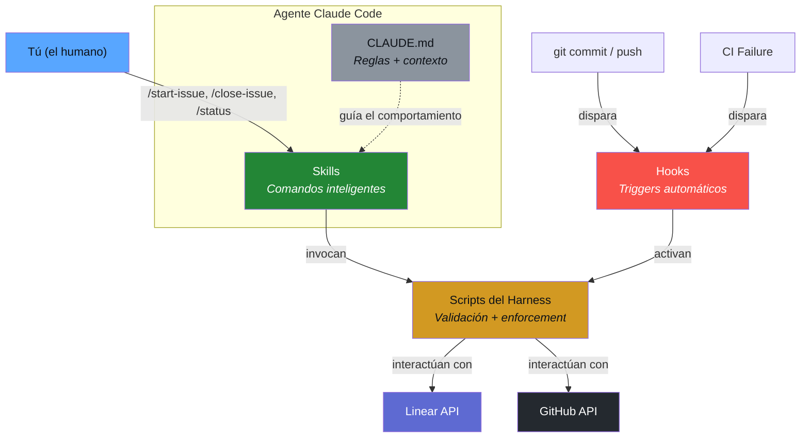
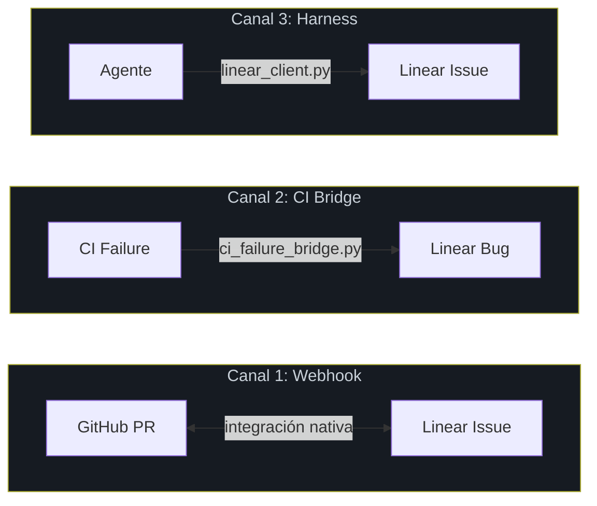
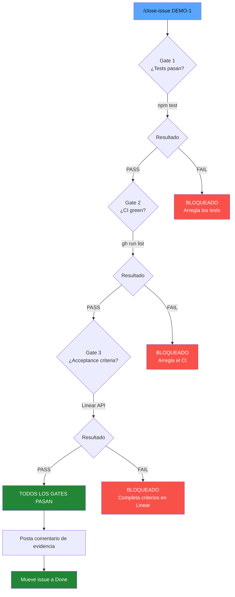
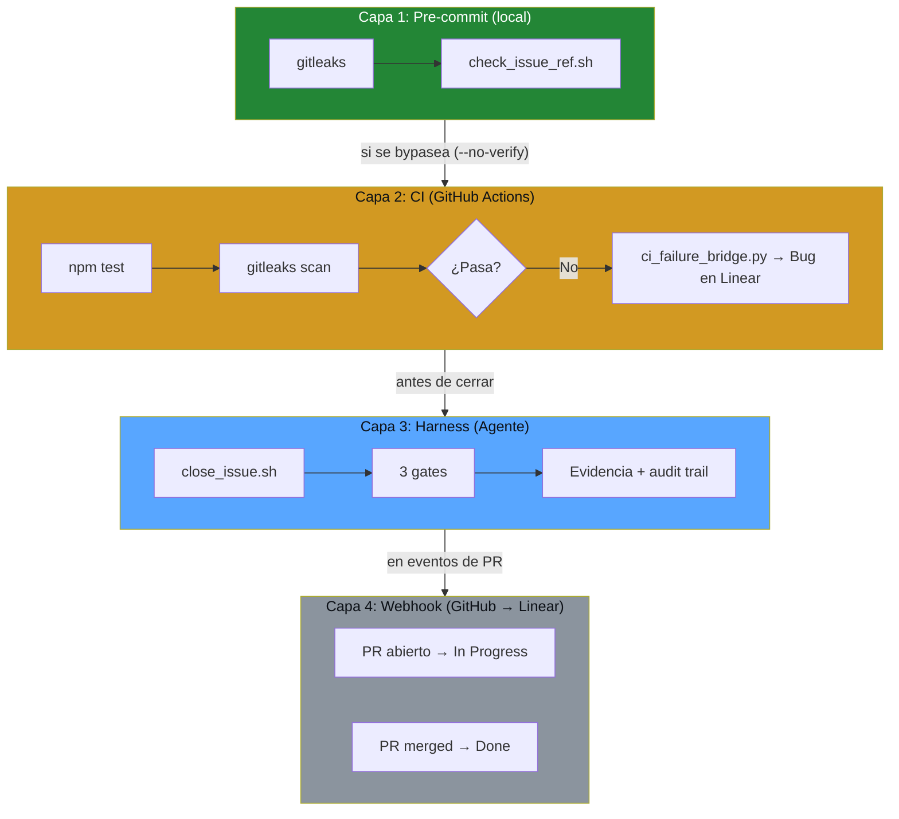
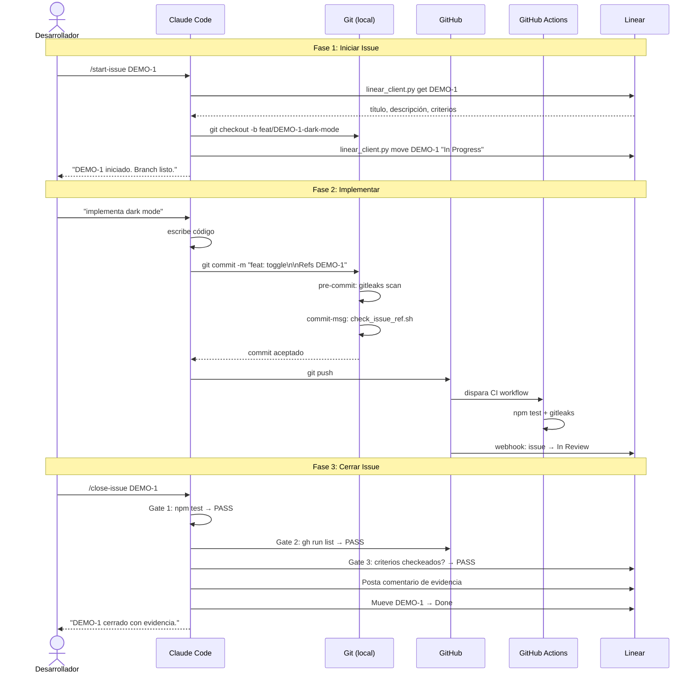
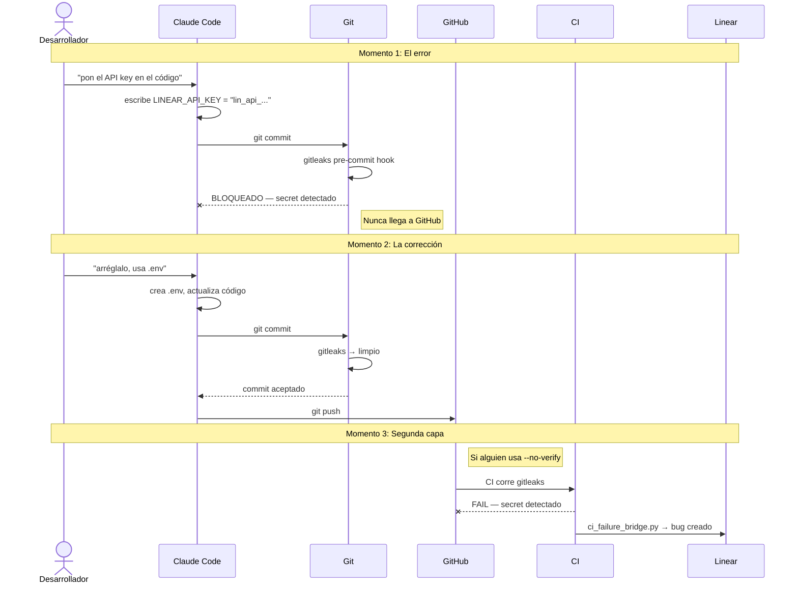

# Arquitectura

[English](architecture.md)

## Vista General del Sistema

Harness-Driven Development conecta 4 componentes en un sistema de enforcement.



## Los 4 Componentes

| Componente | Quién lo usa | Cuándo se activa | Qué hace |
| ---------- | ------------ | ---------------- | -------- |
| **Skills** (recetas) | TÚ los invocas | `/start-issue`, `/close-issue`, `/status` | Ejecuta una receta que llama al harness |
| **Harness** (scripts) | Los skills los invocan, o los hooks los disparan | Cuando un skill lo necesita, o un hook se activa | Verifica reglas y ejecuta validaciones |
| **Hooks** (triggers) | Se activan AUTOMÁTICAMENTE | `git commit`, CI failure | Ejecutan scripts del harness automáticamente |
| **CLAUDE.md** (reglas) | El agente lo lee al iniciar sesión | Siempre — contexto permanente | Define las reglas que todo respeta |

## La Analogía

```
Piensen en un restaurante:

  CLAUDE.md  = El manual de operaciones
               "Así se hacen las cosas aquí"

  SKILLS     = Las recetas del menú
               El chef (agente) sabe ejecutarlas
               "/start-issue" = "preparar la orden"
               "/close-issue" = "servir el plato"

  HARNESS    = El control de calidad
               Verifica que el plato tiene todo
               "¿Sal? ¿Temperatura correcta? ¿Presentación?"

  HOOKS      = Los sensores automáticos
               La alarma del horno, el timer, el termómetro
               Se activan solos
```

## 3 Canales de Comunicación



| Canal | Dirección | Mecanismo | Acciones |
| ----- | --------- | --------- | -------- |
| **Webhook** | Linear ↔ GitHub | Integración nativa | PR abierto → In Progress, merged → Done |
| **CI Bridge** | GitHub → Linear | `ci_failure_bridge.py` | CI falla → auto-crea bug (idempotente) |
| **Harness** | Agente → Linear | `linear_client.py` | Lee issues, crea branches, cierra con evidencia |

## Sistema de Gates (close_issue.sh)



## 4 Capas de Enforcement



## Flujo de Datos: End to End



## Flujo del Secret Bloqueado (el "Momento Wow")


