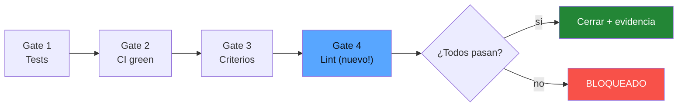

# Preguntas Frecuentes

[English](faq.md)

## General

### ¿Qué es Harness-Driven Development?

Un enfoque donde un agente IA hace cumplir mecánicamente las buenas prácticas de software a través de scripts, hooks y gates — no a través de confianza o acuerdos sociales.

### ¿Por qué no solo usar CI/CD?

CI es una capa. HDD agrega 3 más: pre-commit hooks (enforcement local), harness scripts (verificación de gates), y webhooks (sincronización automática de estado). CI solo atrapa problemas después del push; HDD los atrapa en el momento del commit.

### ¿Es solo para desarrollo asistido por IA?

No. Los hooks y scripts de CI funcionan sin el agente IA. El agente agrega la capa de skills (los comandos `/create-issue`, `/start-issue`, `/close-issue`, `/status`) que orquesta el flujo completo, pero el enforcement funciona independientemente.

## Setup

### ¿Funciona con Jira en lugar de Linear?

Sí. Reemplaza `scripts/linear_client.py` con un cliente de la API REST de Jira. La arquitectura del harness (hooks, gates, CI bridge) es agnóstica a la herramienta. Solo necesitas cambiar las llamadas a la API.

### ¿Funciona con GitLab en lugar de GitHub?

Sí. Reemplaza:
- `.github/workflows/` → `.gitlab-ci.yml`
- Llamadas al CLI `gh` → CLI `glab` o GitLab API
- GitHub webhook → GitLab webhook

Los scripts y skills se mantienen igual.

### ¿Puedo usar otro agente IA en lugar de Claude Code?

Los scripts del harness (`close_issue.sh`, `check_issue_ref.sh`, etc.) son standalone y funcionan con cualquier agente o manualmente. Los skills (`.claude/skills/`) son específicos de Claude Code pero se podrían adaptar a otros frameworks de agentes.

### ¿Cómo agrego mis propios gates?

Edita `scripts/close_issue.sh`. Cada gate es una verificación simple:

```bash
echo -n "Gate N/N — Tu verificación... "
if tu_comando_de_verificacion; then
    echo "PASS"
    GATES_PASSED=$((GATES_PASSED + 1))
else
    echo "FAIL"
fi
```

Actualiza `GATES_TOTAL` para que coincida con el nuevo conteo.

Ejemplo: agregar un gate de "lint check":



## Uso

### ¿Por qué "Refs" y nunca "Closes" en commits?

`Closes`, `Fixes` y `Resolves` son palabras mágicas de GitHub que auto-cierran issues cuando un PR se mergea. Esto bypasea los gates del harness — el issue se cierra sin verificar tests, CI o criterios de aceptación. `Refs` linkea el commit al issue sin cerrarlo.

### ¿Qué pasa si necesito cerrar un issue manualmente?

No lo hagas. Usa `/close-issue DEMO-X`. Si un gate está fallando y crees que es un falso positivo, arregla la lógica del gate en lugar de bypasearlo. El punto es enforcement mecánico.

### ¿Puede el agente bypasear el harness?

Las reglas de `CLAUDE.md` lo prohíben explícitamente. Los pre-commit hooks son una capa adicional que el agente no puede sobreescribir (corren en git, no en el agente). Incluso si alguien usa `--no-verify` para saltar los hooks locales, CI lo atrapa como segunda capa.

### ¿Qué pasa cuando CI falla?

El workflow `linear-bridge.yml` se dispara automáticamente. Ejecuta `ci_failure_bridge.py`, que crea un bug en Linear con:
- El nombre del job que falló
- El nombre del branch
- Un link al run de GitHub Actions

Si ya existe un bug de bridge abierto, agrega un comentario en lugar de crear un duplicado.

## Arquitectura

### ¿Por qué un cliente GraphQL propio en lugar del MCP de Linear?

El MCP de Linear (Model Context Protocol) tiene limitaciones:
- No asigna issues a proyectos → issues huérfanos
- No preserva formato markdown → descripciones rotas
- Sin mecanismo de retry → fallas silenciosas

El cliente propio (`linear_client.py`, ~380 líneas) da control total sobre el payload, routing automático a proyectos, soporte multi-workspace, y manejo de errores apropiado.

### ¿Cuántas líneas de código tiene todo el harness?

```
linear_client.py      ~380 líneas
ci_failure_bridge.py  ~135 líneas
close_issue.sh        ~120 líneas
check_issue_ref.sh     ~70 líneas
──────────────────────────────────
Total                 ~710 líneas
```

Más ~50 líneas de configs YAML. Todo el sistema de enforcement tiene menos de 800 líneas.

### ¿Puedo agregar más buenas prácticas?

Sí. El proyecto identifica 12 buenas prácticas de la industria. El demo cubre 5. Para agregar más:

1. Escribe un script de validación en `scripts/`
2. Agrégalo como gate en `close_issue.sh` o como hook
3. Referéncialo en `CLAUDE.md`
4. Opcionalmente crea un skill si necesita interacción con el usuario

## Escalabilidad

### ¿Funciona para equipos grandes?

Sí. Cada equipo puede definir sus propios gates. El enforcement es mecánico — no depende de la cultura de code review o la disciplina individual. Enfoque común:
- Hooks compartidos vía `.pre-commit-config.yaml` (commiteado al repo)
- Gates específicos por equipo en `close_issue.sh`
- CI como segunda capa universal

### ¿Impacto en performance?

- Pre-commit hooks: < 2 segundos (gitleaks es rápido)
- CI: agrega ~30 segundos por el scan de gitleaks
- Gate checks: < 10 segundos (mayormente llamadas a APIs)
- Linear bridge: corre solo en falla, < 5 segundos

### ¿Puedo usar esto en un monorepo?

Sí. Puedes scoping hooks y gates por paquete/directorio. Los pre-commit hooks y CI workflows soportan filtros por path.
