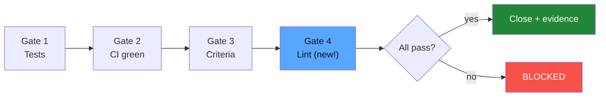

# FAQ

[Español](faq.es.md)

## General

### What is Harness-Driven Development?

An approach where an AI agent mechanically enforces software best practices through scripts, hooks, and gates — not through trust or social agreements.

### Why not just use CI/CD?

CI is one layer. HDD adds 3 more: pre-commit hooks (local enforcement), harness scripts (gate verification), and webhooks (automatic state sync). CI alone catches problems after push; HDD catches them at commit time.

### Is this only for AI-assisted development?

No. The hooks and CI scripts work without the AI agent. The agent adds the skill layer (the `/start-issue`, `/close-issue`, `/status` commands) that orchestrates the full flow, but the enforcement works independently.

## Setup

### Does this work with Jira instead of Linear?

Yes. Replace `scripts/linear_client.py` with a Jira REST API client. The harness architecture (hooks, gates, CI bridge) is tool-agnostic. You only need to change the API calls.

### Does this work with GitLab instead of GitHub?

Yes. Replace:
- `.github/workflows/` → `.gitlab-ci.yml`
- `gh` CLI calls → `glab` CLI or GitLab API
- GitHub webhook → GitLab webhook

The scripts and skills stay the same.

### Can I use a different AI agent instead of Claude Code?

The harness scripts (`close_issue.sh`, `check_issue_ref.sh`, etc.) are standalone and work with any agent or manually. The skills (`.claude/skills/`) are specific to Claude Code but could be adapted to other agent frameworks.

### How do I add my own gates?

Edit `scripts/close_issue.sh`. Each gate is a simple check:

```bash
echo -n "Gate N/N — Your check... "
if your_check_command; then
    echo "PASS"
    GATES_PASSED=$((GATES_PASSED + 1))
else
    echo "FAIL"
fi
```

Update `GATES_TOTAL` to match the new count.

Example: adding a "lint check" gate:



## Usage

### Why "Refs" and never "Closes" in commits?

`Closes`, `Fixes`, and `Resolves` are GitHub magic words that auto-close issues when a PR is merged. This bypasses the harness gates — the issue gets closed without verifying tests, CI, or acceptance criteria. `Refs` links the commit to the issue without closing it.

### What if I need to close an issue manually?

Don't. Use `/close-issue DEMO-X`. If a gate is failing and you believe it's a false positive, fix the gate logic rather than bypassing it. The whole point is mechanical enforcement.

### Can the agent bypass the harness?

The `CLAUDE.md` rules explicitly forbid it. The pre-commit hooks are an additional layer that the agent cannot override (they run in git, not in the agent). Even if someone uses `--no-verify` to skip local hooks, CI catches it as a second layer.

### What happens when CI fails?

The `linear-bridge.yml` workflow triggers automatically. It runs `ci_failure_bridge.py`, which creates a bug in Linear with:
- The failing job name
- The branch name
- A link to the GitHub Actions run

If a bridge bug already exists, it adds a comment instead of creating a duplicate.

## Architecture

### Why a custom GraphQL client instead of the Linear MCP?

The Linear MCP (Model Context Protocol) has limitations:
- Doesn't assign issues to projects → orphan issues
- Doesn't preserve markdown formatting → broken descriptions
- No retry mechanism → silent failures

The custom client (`linear_client.py`, ~170 lines) gives full control over the payload, automatic project routing, and proper error handling.

### How many lines of code is the entire harness?

```
linear_client.py      ~170 lines
close_issue.sh         ~95 lines
check_issue_ref.sh     ~50 lines
ci_failure_bridge.py  ~100 lines
──────────────────────────────
Total                 ~415 lines
```

Plus ~50 lines across YAML configs. The entire enforcement system is under 500 lines.

### Can I add more best practices?

Yes. The project identifies 12 industry best practices. The demo covers 5. To add more:

1. Write a validation script in `scripts/`
2. Add it as a gate in `close_issue.sh` or as a hook
3. Reference it in `CLAUDE.md`
4. Optionally create a skill if it needs user interaction

## Scaling

### Does this work for large teams?

Yes. Each team can define their own gates. The enforcement is mechanical — it doesn't depend on code review culture or individual discipline. Common approach:
- Shared hooks via `.pre-commit-config.yaml` (committed to repo)
- Team-specific gates in `close_issue.sh`
- CI as the universal second layer

### Performance impact?

- Pre-commit hooks: < 2 seconds (gitleaks is fast)
- CI: adds ~30 seconds for gitleaks scan
- Gate checks: < 10 seconds (mostly API calls)
- Linear bridge: runs only on failure, < 5 seconds

### Can I use this in a monorepo?

Yes. You can scope hooks and gates per package/directory. The pre-commit hooks and CI workflows support path filters.
