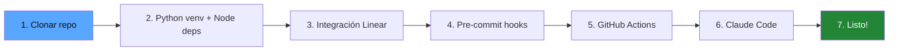
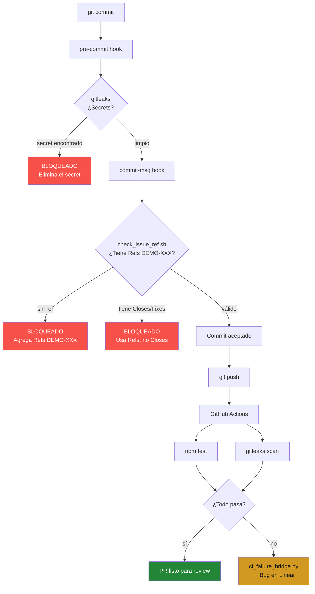

# Guía de Setup

[English](setup-guide.md)

Guía paso a paso para replicar Harness-Driven Development en tu propio proyecto.

> **Nota**: `DEMO` se usa como ejemplo de clave de equipo en toda esta guía. Reemplaza con la clave real de tu equipo en Linear (ej., `HAR`, `EXP`, `PROJ`). El prefijo se define al crear tu equipo en Linear y determina los IDs de tus issues (ej., `HAR-1`, `EXP-1`).

## Flujo de Setup



## 1. Prerrequisitos

| Herramienta | Versión | Instalar |
|-------------|---------|----------|
| Node.js | 18+ | [nodejs.org](https://nodejs.org/) |
| Python | 3.9+ | [python.org](https://python.org/) |
| Claude Code | Última | [docs.anthropic.com](https://docs.anthropic.com/en/docs/claude-code) |
| GitHub CLI | 2.0+ | [cli.github.com](https://cli.github.com/) |
| pre-commit | 3.0+ | `pip install pre-commit` |
| Cuenta de Linear | — | [linear.app](https://linear.app/) |

## 2. Setup del Repositorio

```bash
git clone https://github.com/felirangelp/harness-driven-dev.git
cd harness-driven-dev

# Ambiente virtual Python
python3 -m venv .venv
source .venv/bin/activate    # macOS/Linux
# .venv\Scripts\activate     # Windows

# Dependencias Node
npm install
```

## 3. Integración con Linear

### 3.1 Conectar Linear con GitHub

1. Ve a **Linear → Settings → Integrations → GitHub**
2. Instala la **Linear GitHub App** en tu cuenta de GitHub
3. Selecciona los repositorios que quieras conectar
4. Activa:
   - PR automations
   - Magic words
   - Linkbacks

### 3.2 Crear una API Key de Linear

1. Ve a **Linear → Settings → API → Personal API keys → Create**
2. Copia la key (empieza con `lin_api_...`)

### 3.3 Configurar la API Key

**Localmente** (para desarrollo):
```bash
cp .env.example .env
# Edita .env y pega tu key:
# LINEAR_API_KEY=lin_api_your_key_here
```

**En GitHub** (para CI):
```bash
gh secret set LINEAR_API_KEY
# Pega tu key cuando te lo pida
```

### 3.4 Verificar

```bash
python3 scripts/linear_client.py list
```

Deberías ver tus issues de Linear listados.

## 4. Pre-commit Hooks

```bash
pip install pre-commit
pre-commit install --hook-type pre-commit --hook-type commit-msg
```

Esto instala dos hooks:

| Hook | Stage | Qué hace |
|------|-------|----------|
| gitleaks | pre-commit | Escanea secrets (API keys, passwords, tokens) |
| check-issue-ref | commit-msg | Asegura que `Refs DEMO-XXX` esté en cada commit |

### Verificar que los hooks funcionan

```bash
# Esto debe PASAR
pre-commit run --all-files

# Esto debe BLOQUEAR (sin referencia a issue)
echo "test" > /tmp/test-msg.txt
bash scripts/check_issue_ref.sh /tmp/test-msg.txt
# Esperado: BLOCKED
```

## 5. GitHub Actions

CI corre automáticamente en push/PR a `main`. Dos workflows:

| Workflow | Archivo | Trigger | Qué hace |
|----------|---------|---------|----------|
| CI | `.github/workflows/ci.yml` | push, PR | Corre tests + gitleaks |
| Linear Bridge | `.github/workflows/linear-bridge.yml` | CI failure | Crea bug en Linear |

No necesita configuración extra — solo asegúrate de que `LINEAR_API_KEY` esté como GitHub secret (paso 3.3).

## 6. Claude Code

### 6.1 Instalar Claude Code

Sigue la [guía oficial](https://docs.anthropic.com/en/docs/claude-code).

### 6.2 Verificar Skills

Inicia Claude Code en el directorio del proyecto:

```bash
cd harness-driven-dev
claude
```

El agente leerá `CLAUDE.md` y tendrá acceso a 4 skills:

- `/create-issue <título>` — Crear un nuevo issue en Linear con criterios de aceptación
- `/start-issue DEMO-X` — Iniciar trabajo en un issue
- `/close-issue DEMO-X` — Cerrar con evidencia
- `/status` — Dashboard del proyecto

## 7. Setup del Proyecto en Linear (para Demos)

1. Crea un **Team** en Linear (ej., "Demo")
2. Crea un **Project** (ej., "HDD Demo")
3. Crea 3 issues:
   - `DEMO-1`: "Add dark mode toggle"
   - `DEMO-2`: "Add task counter per column"
   - `DEMO-3`: "Add drag and drop between columns"
4. Pon todos los issues en estado **To Do**

## 8. Convención de Nombres de Branch

El webhook de Linear detecta identificadores de issues en nombres de branch:

```
feat/DEMO-1-dark-mode        ✅ Detectado → linkea PR al issue
fix/DEMO-2-counter-bug       ✅ Detectado
my-feature-branch            ❌ No detectado → sin auto-linking
```

Patrón: `{type}/DEMO-{N}-{slug}`

Tipos: `feat`, `fix`, `docs`, `test`, `chore`, `refactor`

## 9. Política de Keywords

| Keyword | ¿Permitido? | Por qué |
|---------|-------------|---------|
| `Refs DEMO-XXX` | Siempre | Linkea commit al issue sin cerrarlo |
| `Closes DEMO-XXX` | Nunca | Auto-cierra el issue, bypasea los gates del harness |
| `Fixes DEMO-XXX` | Nunca | Igual que Closes |
| `Resolves DEMO-XXX` | Nunca | Igual que Closes |

El hook `check_issue_ref.sh` hace cumplir esto automáticamente.

## Cómo Funcionan los Hooks Juntos



## Troubleshooting

**"LINEAR_API_KEY not set"**
- Verifica que el archivo `.env` existe y tiene la key
- Ejecuta `source .venv/bin/activate` antes de correr scripts

**"pre-commit not found"**
- Ejecuta `pip install pre-commit` dentro del ambiente virtual

**"gh: command not found"**
- Instala GitHub CLI: https://cli.github.com/

**Tests fallan con "Cannot find module jsdom"**
- Ejecuta `npm install` para instalar dependencias
