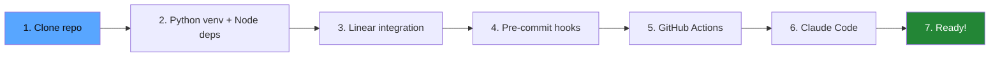
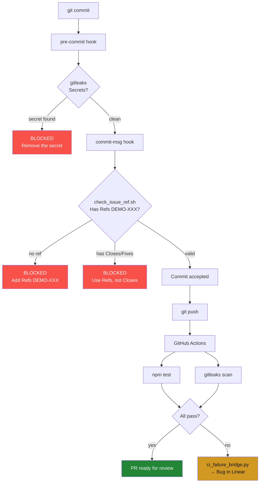

# Setup Guide

[Español](setup-guide.es.md)

Step-by-step guide to replicate Harness-Driven Development in your own project.

## Setup Flow Overview



## 1. Prerequisites

| Tool | Version | Install |
|------|---------|---------|
| Node.js | 18+ | [nodejs.org](https://nodejs.org/) |
| Python | 3.9+ | [python.org](https://python.org/) |
| Claude Code | Latest | [docs.anthropic.com](https://docs.anthropic.com/en/docs/claude-code) |
| GitHub CLI | 2.0+ | [cli.github.com](https://cli.github.com/) |
| pre-commit | 3.0+ | `pip install pre-commit` |
| Linear account | — | [linear.app](https://linear.app/) |

## 2. Repository Setup

```bash
git clone https://github.com/felirangelp/harness-driven-dev.git
cd harness-driven-dev

# Python virtual environment
python3 -m venv .venv
source .venv/bin/activate    # macOS/Linux
# .venv\Scripts\activate     # Windows

# Node dependencies
npm install
```

## 3. Linear Integration

### 3.1 Connect Linear with GitHub

1. Go to **Linear → Settings → Integrations → GitHub**
2. Install the **Linear GitHub App** on your GitHub account
3. Select the repositories you want to connect
4. Enable:
   - PR automations
   - Magic words
   - Linkbacks

### 3.2 Create a Linear API Key

1. Go to **Linear → Settings → API → Personal API keys → Create**
2. Copy the key (starts with `lin_api_...`)

### 3.3 Configure the API Key

**Locally** (for development):
```bash
cp .env.example .env
# Edit .env and paste your key:
# LINEAR_API_KEY=lin_api_your_key_here
```

**In GitHub** (for CI):
```bash
gh secret set LINEAR_API_KEY
# Paste your key when prompted
```

### 3.4 Verify

```bash
python3 scripts/linear_client.py list
```

You should see your Linear issues listed.

## 4. Pre-commit Hooks

```bash
pip install pre-commit
pre-commit install --hook-type pre-commit --hook-type commit-msg
```

This installs two hooks:

| Hook | Stage | What it does |
|------|-------|-------------|
| gitleaks | pre-commit | Scans for secrets (API keys, passwords, tokens) |
| check-issue-ref | commit-msg | Ensures `Refs DEMO-XXX` is in every commit message |

### Verify hooks work

```bash
# This should PASS
pre-commit run --all-files

# This should BLOCK (no issue ref)
echo "test" > /tmp/test-msg.txt
bash scripts/check_issue_ref.sh /tmp/test-msg.txt
# Expected: BLOCKED
```

## 5. GitHub Actions

CI runs automatically on push/PR to `main`. Two workflows:

| Workflow | File | Trigger | What it does |
|----------|------|---------|-------------|
| CI | `.github/workflows/ci.yml` | push, PR | Runs tests + gitleaks |
| Linear Bridge | `.github/workflows/linear-bridge.yml` | CI failure | Creates bug in Linear |

No extra configuration needed — just ensure `LINEAR_API_KEY` is set as a GitHub secret (step 3.3).

## 6. Claude Code

### 6.1 Install Claude Code

Follow the [official guide](https://docs.anthropic.com/en/docs/claude-code).

### 6.2 Verify Skills

Start Claude Code in the project directory:

```bash
cd harness-driven-dev
claude
```

The agent will read `CLAUDE.md` and have access to 3 skills:

- `/start-issue DEMO-X` — Start work on an issue
- `/close-issue DEMO-X` — Close with evidence
- `/status` — Project dashboard

## 7. Linear Project Setup (for Demos)

1. Create a **Team** in Linear (e.g., "Demo")
2. Create a **Project** (e.g., "HDD Demo")
3. Create 3 issues:
   - `DEMO-1`: "Add dark mode toggle"
   - `DEMO-2`: "Add task counter per column"
   - `DEMO-3`: "Add drag and drop between columns"
4. Set all issues to **To Do** state

## 8. Branch Naming Convention

The Linear webhook detects issue identifiers in branch names:

```
feat/DEMO-1-dark-mode        ✅ Detected → links PR to issue
fix/DEMO-2-counter-bug       ✅ Detected
my-feature-branch            ❌ Not detected → no auto-linking
```

Pattern: `{type}/DEMO-{N}-{slug}`

Types: `feat`, `fix`, `docs`, `test`, `chore`, `refactor`

## 9. Keyword Policy

| Keyword | Allowed? | Why |
|---------|----------|-----|
| `Refs DEMO-XXX` | Always | Links commit to issue without closing |
| `Closes DEMO-XXX` | Never | Auto-closes issue, bypasses harness gates |
| `Fixes DEMO-XXX` | Never | Same as Closes |
| `Resolves DEMO-XXX` | Never | Same as Closes |

The `check_issue_ref.sh` hook enforces this automatically.

## How the Hooks Work Together



## Troubleshooting

**"LINEAR_API_KEY not set"**
- Check `.env` file exists and has the key
- Run `source .venv/bin/activate` before running scripts

**"pre-commit not found"**
- Run `pip install pre-commit` inside the virtual environment

**"gh: command not found"**
- Install GitHub CLI: https://cli.github.com/

**Tests fail with "Cannot find module jsdom"**
- Run `npm install` to install dependencies
